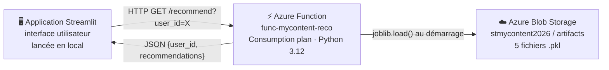
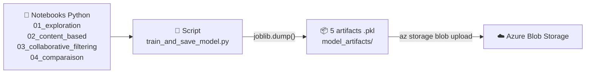
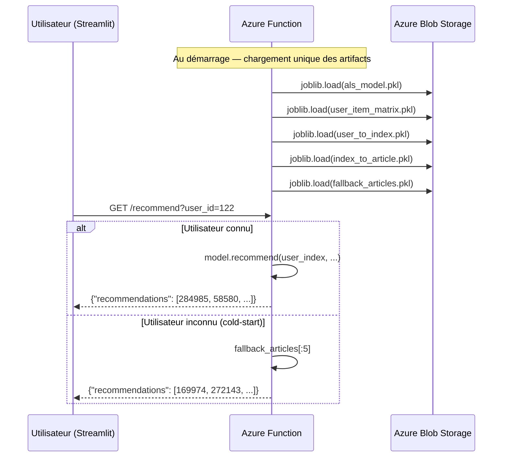
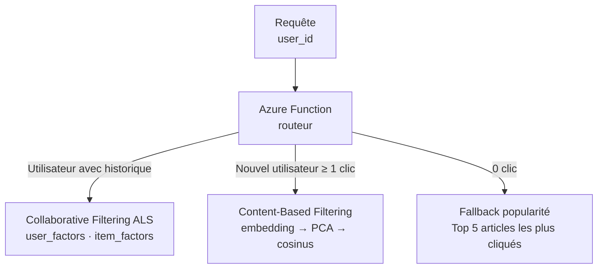
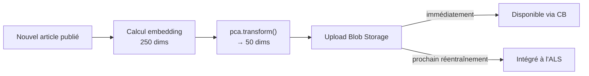

# Architecture du projet — My Content

## Architecture déployée (MVP)



### Phase entraînement (local)



### Phase inférence (Azure)



---

## Architecture cible (hybride)



### Gestion des nouveaux articles (cible)



---

## Artifacts du modèle

| Fichier | Contenu | Taille |
|---------|---------|--------|
| `als_model.pkl` | Modèle ALS entraîné (`implicit`) | 73,8 Mo |
| `user_item_matrix.pkl` | Matrice user × article (sparse CSR) | 36,7 Mo |
| `user_to_index.pkl` | Mapping user_id → index matrice | 7,6 Mo |
| `index_to_article.pkl` | Mapping index → article_id | 1 Mo |
| `fallback_articles.pkl` | Top-5 articles populaires | 41 octets |

**Total : 147,6 Mo** · Stockés sur Azure Blob Storage (`stmycontent2026/artifacts`)

---

## Infrastructure Azure

| Ressource | Détail |
|-----------|--------|
| Groupe de ressources | `rg-mycontent` (France Central) |
| Compte de stockage | `stmycontent2026` |
| Azure Function | `func-mycontent-reco` — plan Consommation |
| URL endpoint | `https://func-mycontent-reco.azurewebsites.net/api/recommend` |

> ⚠️ La Function App est mise en pause entre les sessions pour économiser les crédits.
>
> ```bash
> az functionapp start --name func-mycontent-reco --resource-group rg-mycontent
> az functionapp stop --name func-mycontent-reco --resource-group rg-mycontent
> ```
